<!-- brief:start -->

<a href="https://vetswhocode.io">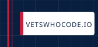</a><a href="https://vetswhocode.io/donate">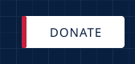</a>
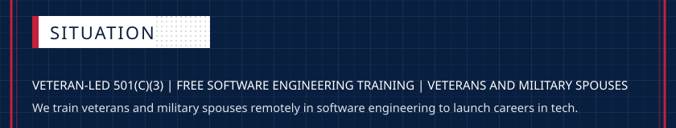
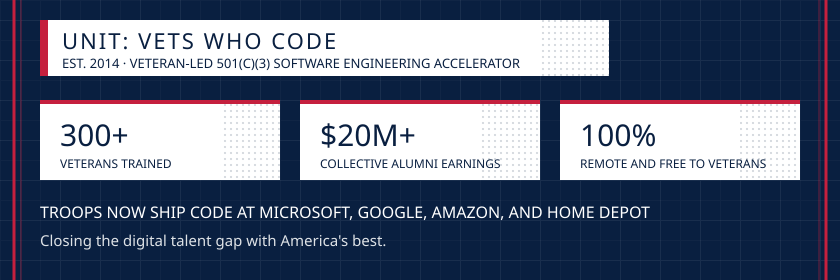
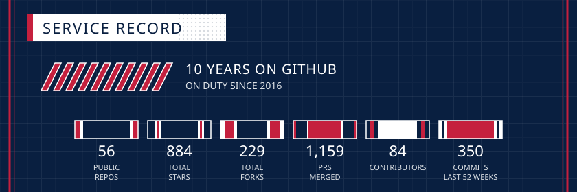
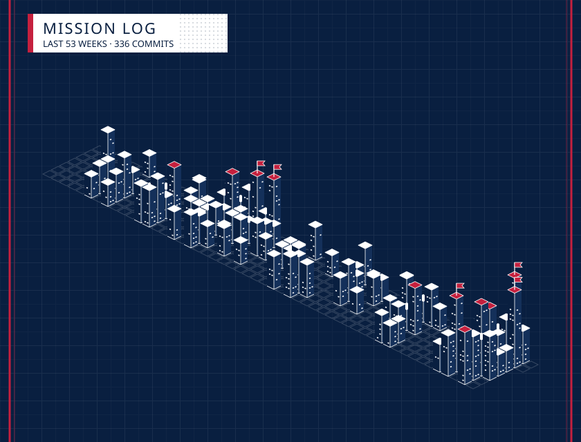
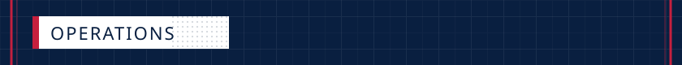
<a href="https://github.com/Vets-Who-Code/vets-who-code-app">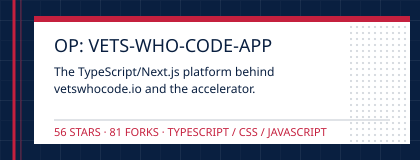</a><a href="https://vets-who-code.github.io/">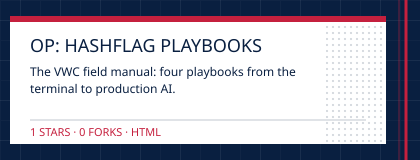</a>
<a href="https://github.com/Vets-Who-Code/Prework">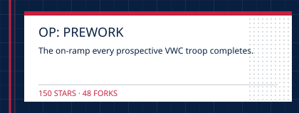</a><a href="https://github.com/Vets-Who-Code/windows-dev-guide">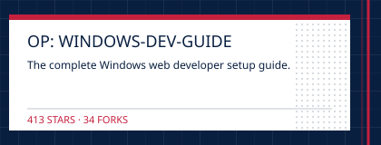</a>
<a href="https://github.com/Vets-Who-Code/api-list">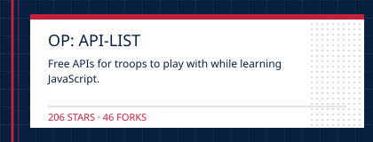</a><a href="https://github.com/Vets-Who-Code/vetswhocode-vs-code-theme">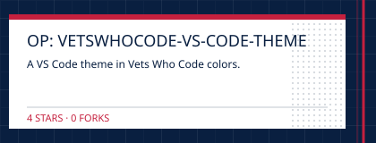</a>
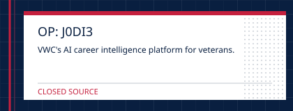<a href="https://github.com/orgs/Vets-Who-Code/projects/82">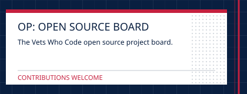</a>
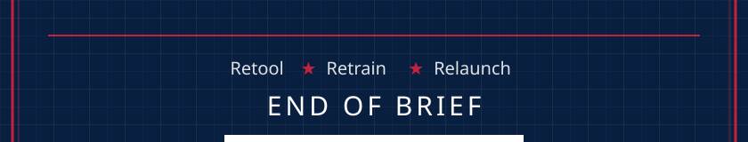

<!-- brief:end -->
